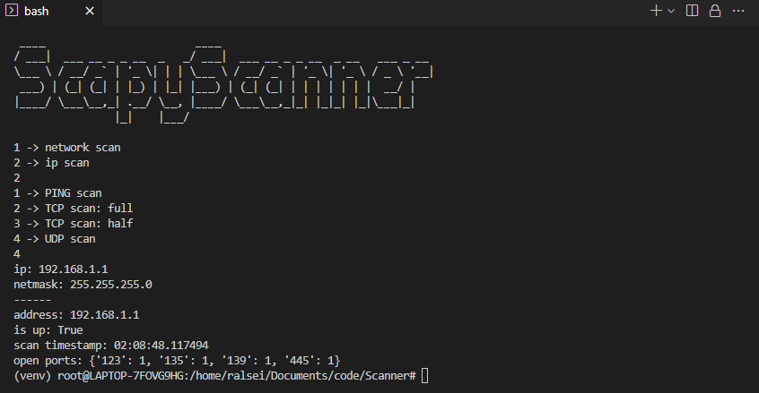

# ScapyScanner

Python network scanner built upon the Scapy library.


## setup
```bash
apt-get install python3
sudo apt-get install python3-venv
pip install scapy
```
## setup with venv
```bash
apt-get install python3
sudo apt-get install python3-venv
python3 -m venv venv
source ./venv/bin/activate
pip install -r requirements.txt
```

## Miscellaneous
### scapy shell
installing Scapy can be useful for testing / debugging
```bash
sudo apt install scapy
scapy
>>> ls(Ether)
"
dst        : DestMACField                        = (None)
src        : SourceMACField                      = (None)
type       : XShortEnumField                     = (36864)
"
```
### pycov
coverage reports using [pycov](https://pytest-cov.readthedocs.io/en/latest/readme.html)
```bash
pytest --cov=scanner tests/
```

### To Do
- [x] continuous integration, using pycov !
